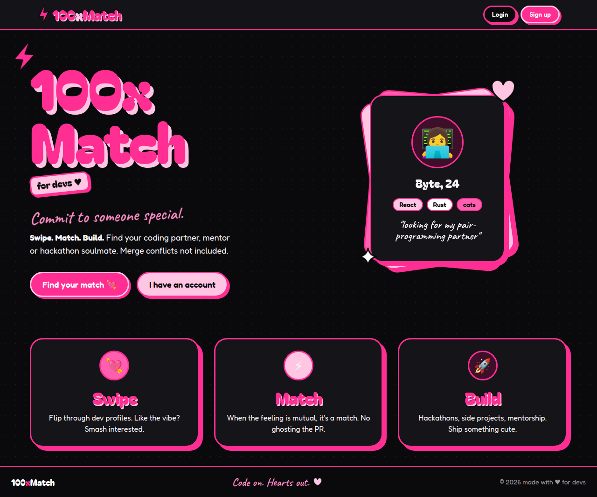
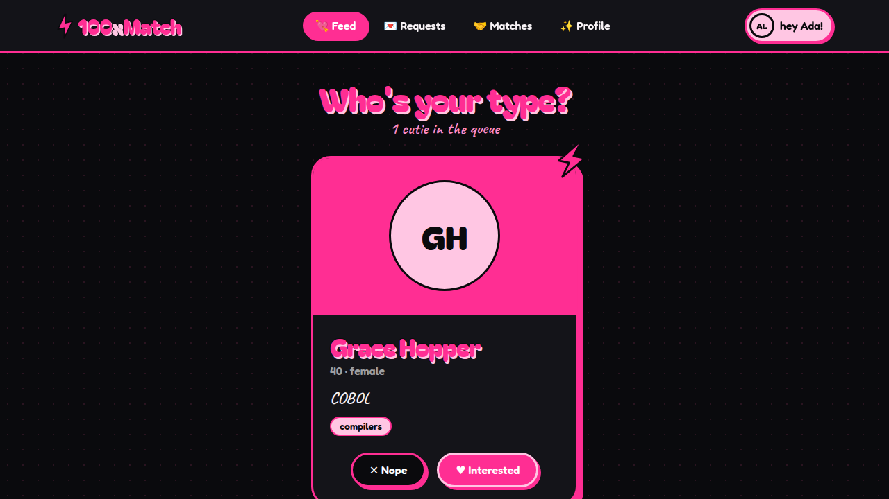
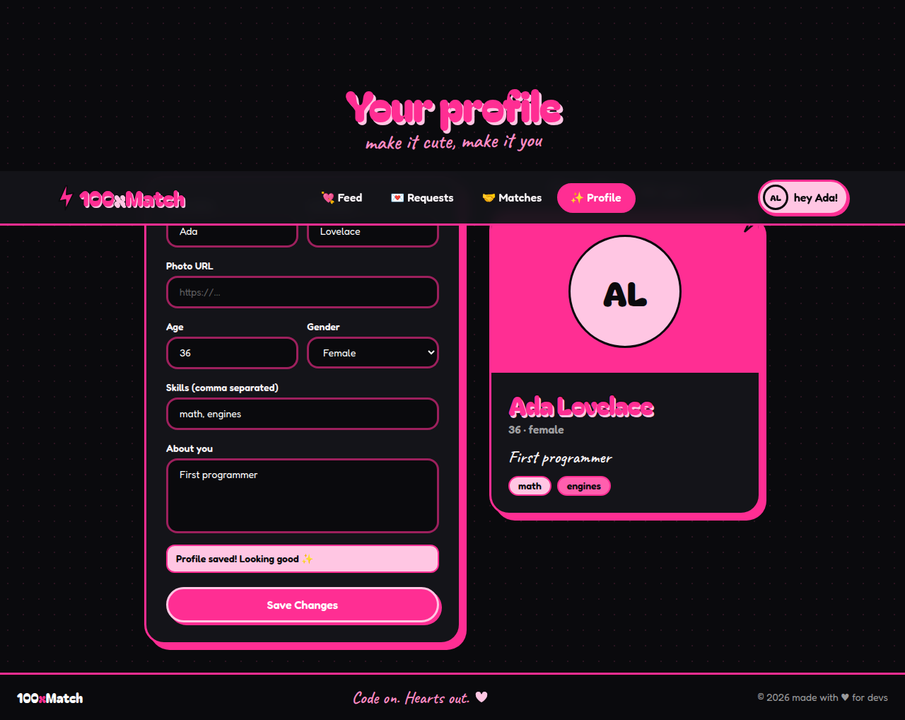
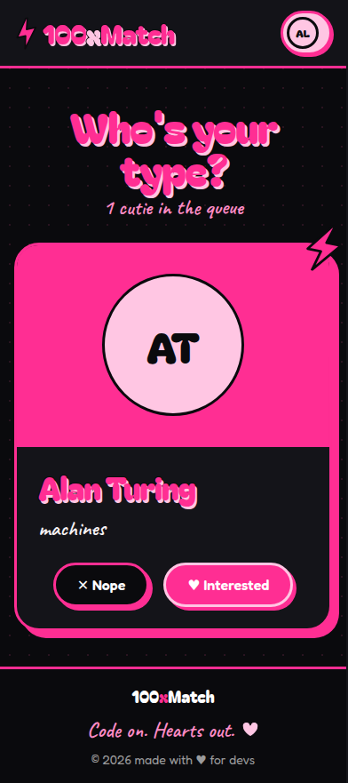

<div align="center">

# ⚡ 100xMatch

**Find your dev crush.** A Tinder-style app for developers: swipe through profiles, show interest, match, and build something together.

[](https://github.com/Jatin4224/100-x-Match/actions/workflows/ci.yml)
[](LICENSE)
[](CONTRIBUTING.md)
[](https://github.com/Jatin4224/100-x-Match/labels/good%20first%20issue)



</div>

---

## Table of contents

- [What is 100xMatch?](#what-is-100xmatch)
- [Features](#features)
- [Screenshots](#screenshots)
- [Tech stack](#tech-stack)
- [Quick start](#quick-start)
- [Project structure](#project-structure)
- [How it works](#how-it-works)
- [API reference](#api-reference)
- [Contributing](#contributing)
- [Roadmap: features you can build](#roadmap-features-you-can-build)
- [Community](#community)
- [License](#license)

## What is 100xMatch?

100xMatch helps developers find coding partners, mentors and hackathon teammates. You see one profile at a time and pick **Interested** or **Nope**. If the other person accepts your request, you're a match.

It's a full-stack MERN project (MongoDB, Express, React, Node), small enough to understand in an afternoon. That makes it a good first open-source project: there's real work to do on the backend, the frontend and the design.

## Features

- 🔐 **Accounts:** sign up, log in and log out, with JWT stored in an httpOnly cookie
- 💘 **Feed:** one profile at a time, with Interested / Nope. People you've already seen are never shown again
- 💌 **Requests ("love letters"):** accept or pass on people who are interested in you
- 🤝 **Matches:** everyone you're connected with
- ✨ **Profile editor:** name, photo, age, gender, skills and bio, with a live preview card
- 🖤 **Black and pink theme:** sticker-style cards, bubble lettering, doodles and animations
- 📱 **Responsive:** works on phones and desktops

## Screenshots

| Feed | Profile editor | Mobile |
|---|---|---|
|  |  |  |

## Tech stack

| Area | Tools |
|---|---|
| Frontend | React 18, Vite, React Router 7, Redux Toolkit, axios, Tailwind CSS 3, daisyUI 4, framer-motion |
| Backend | Node.js, Express 4, Mongoose 8 (MongoDB), zod, bcrypt, jsonwebtoken |
| Testing | Node's built-in test runner (`node --test`) with supertest |
| Fonts | Bagel Fat One, Caveat, Fredoka (bundled via `@fontsource`) |

## Quick start

### Prerequisites

- **Node.js 18 or newer** (`node -v`)
- **MongoDB:** either a free [MongoDB Atlas](https://www.mongodb.com/atlas) cluster or a local install
- **Git**

### 1. Fork and clone

```bash
# Click "Fork" on GitHub first, then:
git clone https://github.com/<your-username>/100-x-Match.git
cd 100-x-Match
git remote add upstream https://github.com/Jatin4224/100-x-Match.git
```

### 2. Run the backend

```bash
cd Backend
cp .env.example .env    # then open .env and fill in MONGO_URL and JWT_SECRET
npm install
npm run dev             # starts on http://localhost:3000
```

| Variable | Required | Description |
|---|---|---|
| `MONGO_URL` | yes | MongoDB connection string, e.g. `mongodb://127.0.0.1:27017/100xmatch` |
| `JWT_SECRET` | yes | Any long random string. Generate one with `node -e "console.log(require('crypto').randomBytes(32).toString('hex'))"` |
| `PORT` | no | Defaults to `4000`. The frontend expects `3000`, which `.env.example` sets |
| `CLIENT_URL` | no | Allowed frontend origin(s), comma separated. Default `http://localhost:5173` |
| `NODE_ENV` | no | `production` makes the cookie `Secure` + `SameSite=None` (needs HTTPS) |

The server refuses to start if `MONGO_URL` or `JWT_SECRET` is missing.

### 3. Run the frontend

In a second terminal:

```bash
cd frontend/frontend
cp .env.example .env    # optional, only needed if your API isn't on localhost:3000
npm install
npm run dev             # opens on http://localhost:5173
```

Open http://localhost:5173 and sign up. To see the feed in action, create two or three accounts in different browsers (or a private window) and send each other requests.

### Useful commands

| Where | Command | What it does |
|---|---|---|
| `Backend/` | `npm run dev` | Start the API with auto-reload (nodemon) |
| `Backend/` | `npm start` | Start the API without auto-reload |
| `Backend/` | `npm test` | Run the API tests (no database needed) |
| `frontend/frontend/` | `npm run dev` | Start the Vite dev server |
| `frontend/frontend/` | `npm run lint` | Run ESLint |
| `frontend/frontend/` | `npm run build` | Production build into `dist/` |

## Project structure

```
100-x-Match/
├── Backend/
│   ├── src/
│   │   ├── app.js              # Express app: middleware, routers, error handlers, startup
│   │   ├── config/db.js        # MongoDB connection
│   │   ├── middleware/auth.js  # userAuth: reads the JWT cookie, loads req.user
│   │   ├── models/
│   │   │   ├── user.js         # User schema (password hidden from JSON)
│   │   │   └── request.js      # Connection request (interested/ignored/accepted/rejected)
│   │   ├── routes/
│   │   │   ├── auth.js         # /signup /signin /signout
│   │   │   ├── profile.js      # /profile/view /profile/edit
│   │   │   ├── request.js      # /request/send/... /request/review/...
│   │   │   └── user.js         # /feed /user/connections /user/requests/received
│   │   └── utils/validate.js   # zod schemas for every request body
│   └── test/api.test.js        # API tests (Mongoose calls are stubbed)
├── frontend/frontend/
│   ├── src/
│   │   ├── App.jsx             # Routes and route guards
│   │   ├── components/         # One file per page or UI piece (Feed, UserCard, Navbar...)
│   │   ├── utils/
│   │   │   ├── api.js          # axios instance (sends cookies) + getErrorMessage
│   │   │   ├── appStore.js     # Redux store; logging out resets every slice
│   │   │   └── *Slice.js       # user, feed, connections, requests
│   │   └── index.css           # Theme component classes (card-pop, btn-hot, chip...)
│   └── tailwind.config.js      # Colors, fonts, shadows and the "blackpink" daisyUI theme
├── docs/screenshots/
├── CONTRIBUTING.md
├── ROADMAP.md
└── README.md
```

## How it works

### Login and sessions

1. **Signup or signin:** the API checks the body with zod, hashes the password with bcrypt and sets a 24-hour JWT in an httpOnly `token` cookie.
2. **Every request:** the frontend's axios instance sends cookies (`withCredentials: true`), and the `userAuth` middleware checks the token and loads `req.user`.
3. **Page refresh:** `Body.jsx` calls `GET /profile/view` to restore the session before showing any page.
4. **Route guards:** `ProtectedRoute` sends logged-out users to `/login`, and `GuestRoute` sends logged-in users away from `/login` and `/signup`.

### The matching flow

```
  A sees B in /feed
        │
        ├── Nope ────────► Request { from: A, to: B, status: "ignored" }    (never shown again)
        │
        └── Interested ──► Request { from: A, to: B, status: "interested" }
                                   │
                    B opens /requests
                                   ├── Pass ───► status: "rejected"
                                   └── Accept ─► status: "accepted"  →  A and B see each other in /matches
```

The feed hides yourself and anyone you already have a request with, in either direction. Only one request can exist per pair of users.

### Theme

All colors live in `frontend/frontend/tailwind.config.js` (`hot`, `baby`, `rose`, `night`, `ink`, `line`). The reusable classes (`card-pop`, `btn-hot`, `btn-baby`, `btn-plain`, `input-pop`, `chip`, `title-bubble`, `scribble`) are in `src/index.css`. Reuse these in new components so the app keeps one look.

## API reference

Base URL: `http://localhost:3000/api/v1`. 🔒 means the route needs the `token` cookie. Responses are JSON shaped as `{ message?, data? }`.

| Method | Path | | Body / params | Description |
|---|---|---|---|---|
| POST | `/signup` | | `firstName`, `lastName`, `email`, `password` | Create an account and log in (201, 409 if the email exists) |
| POST | `/signin` | | `email`, `password` | Log in (401 on bad email or password) |
| POST | `/signout` | | | Clear the cookie |
| GET | `/profile/view` | 🔒 | | The logged-in user |
| PATCH | `/profile/edit` | 🔒 | any of `firstName`, `lastName`, `about`, `age`, `gender`, `photoUrl`, `skills` | Update your profile. Other fields are rejected |
| GET | `/feed` | 🔒 | `?page=1&limit=10` (max 50) | Users you haven't interacted with |
| POST | `/request/send/:status/:toUserId` | 🔒 | `status`: `interested` or `ignored` | React to someone in the feed |
| POST | `/request/review/:status/:requestId` | 🔒 | `status`: `accepted` or `rejected` | Answer a request sent to you |
| GET | `/user/requests/received` | 🔒 | | Pending requests sent to you |
| GET | `/user/connections` | 🔒 | | Your matches |

Password rules for signup: at least 8 characters with an uppercase letter, a lowercase letter, a number and a symbol.

## Contributing

Contributions of all sizes are welcome: bug fixes, features, docs, design and tests. First time contributing to open source? Look for issues labeled [`good first issue`](https://github.com/Jatin4224/100-x-Match/labels/good%20first%20issue).

1. Read **[CONTRIBUTING.md](CONTRIBUTING.md)** for the full workflow, code style and PR checklist.
2. Pick something from the **[roadmap](ROADMAP.md)** or the issue list, and comment that you're working on it.
3. Fork, create a branch, make your change, run the checks, and open a pull request.

```bash
git checkout -b feat/chat-between-matches
# ...make changes...
cd Backend && npm test
cd ../frontend/frontend && npm run lint && npm run build
git commit -m "feat: add chat between matches"
git push origin feat/chat-between-matches
```

## Roadmap: features you can build

The full list, with difficulty levels and hints on where to start, is in **[ROADMAP.md](ROADMAP.md)**. Highlights:

| Feature | Difficulty | Area |
|---|---|---|
| Show sent requests and let users cancel them | 🟢 Easy | Full-stack |
| Pending-request badge in the navbar | 🟢 Easy | Frontend |
| Skill filters in the feed | 🟡 Medium | Full-stack |
| Photo upload (Cloudinary or S3) | 🟡 Medium | Full-stack |
| Forgot / change password by email | 🟡 Medium | Backend |
| Real-time chat between matches (Socket.io) | 🔴 Hard | Full-stack |
| Smarter matching (shared skills first) | 🔴 Hard | Backend |
| GitHub login and showing GitHub stats on profiles | 🔴 Hard | Full-stack |

## Community

- 🐛 **Found a bug?** [Open a bug report](https://github.com/Jatin4224/100-x-Match/issues/new?template=bug_report.md)
- 💡 **Have an idea?** [Suggest a feature](https://github.com/Jatin4224/100-x-Match/issues/new?template=feature_request.md)
- 🔒 **Security issue?** Please don't open a public issue. See [SECURITY.md](SECURITY.md)
- 🤝 Everyone here follows the [Code of Conduct](CODE_OF_CONDUCT.md)

If you like the project, give it a ⭐. It helps other developers find it.

## License

[MIT](LICENSE) © Jatin
